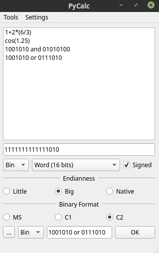

# PyCalc

## What is this?

A programmable calculator designed with binary and logical operations in mind. It allows to convert from decimal to other numeric formats while keeping in account the memory size, endianness of the system and binary rapresentation system (Magnitude and Sign, one's complement, two's complement).
This calculator has support for arithmetic, scientific and logical operations. It also allows the user to define Its own functions and constants.

## How to install:

Before installing make sure to have the latest version of PyQt installed on your system.
clone the repository and execute `python [path to folder]/PyCalc/__init__.py` to run the application. It comes with all the needed external packages so no extra steps are required.

## How does it work?

### Main window:

* To calculate an expression type it in the lower text box and press OK. There is no need to add spaces between numbers and operators or brackets when performing math operations.
* To retrieve a previous operation, select it from the list on top of the screen.
* When using bitwise operations (`and`, `or`, `xor`, etc.) put a space between the number or bit sequence and the operator.
* By default when operating in `Integer` memory mode floating values are truncated to allow binary representation. If you need decimal numbers in your result set the memory to `Float` or `Double`.
* When using binary, octal or hexadecimal formats the inserted byte sequence is automatically padded according to the size of the selected memory format. This means that if if your most significant bit is a 1 the number will be interpreted as a negative decimal number.
* Converting any numeric format to `Oct` requires the memory to be compatible with three bits words system: `Oct Half-Word (6 bits) Oct Word (12 bits) Oct Double Word (24 bits) Oct triple Word (36 bits)`
* Signed memory means it means half of the possible bit combinations will be used to represent negative numbers for instance on 8 bits the maximum and minimum number will be +127 and -127 while if the memory is set to unsigned the max number will be 256 and the min 0.

**Endianness settings:**

|setting | description|
|------------------------|-----------------------------
| Big | fill the byte starting from the most significant bit|
| Little | fill the byte starting from the least significant bit|
| Native | use the endian configuration of the local computer's processor|

**Binary format settings:**

|setting | description| example
|---|---|---
| MS | the most significant bit indicates the sign, while the other N-1 bits are used to represent the number| `00010 = 2 1010 = -2`
| C1 | the most significant bit indicates the sign, to obtain the negative of a number all bits are inverted| `00010 = 2 11101 = -2`
| C2 | the most significant bit indicates the sign, to obtain the negative of a number all bits are inverted and one is added to the result| `00010 = 2 11110 = -2`

## Acknowledgments:

- bitstring library from Dr. Scott Griffiths: https://github.com/scott-griffiths/bitstring
- slickpicker Qt Widget from ShadowKyogre: https://github.com/ShadowKyogre/slickpicker
